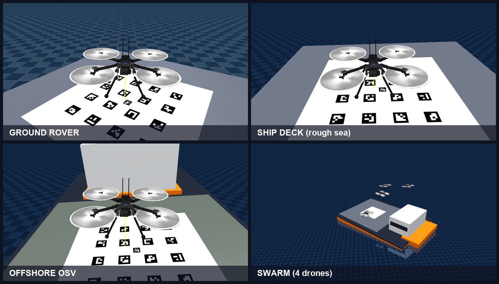
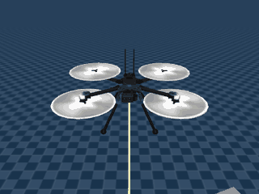
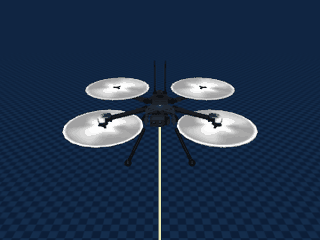
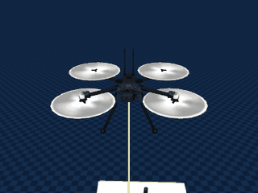
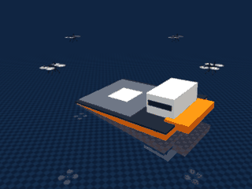
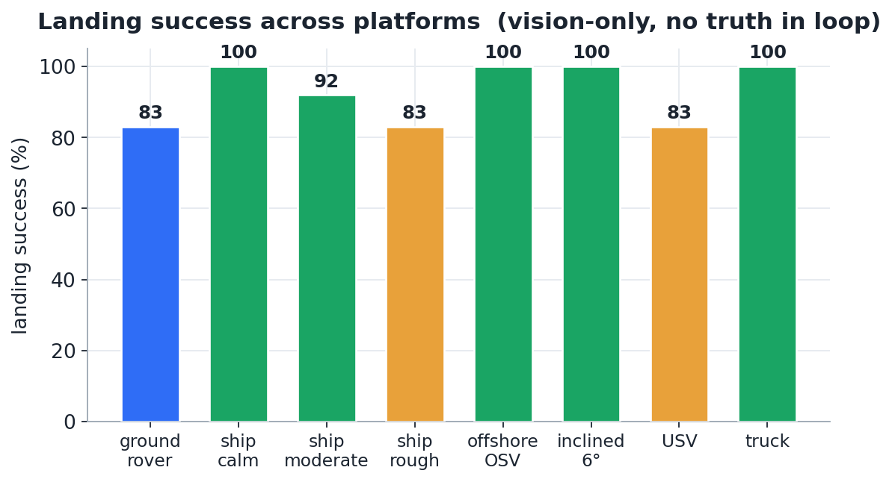
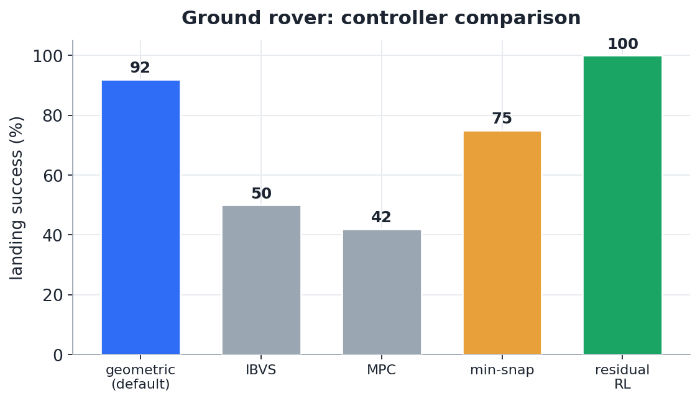
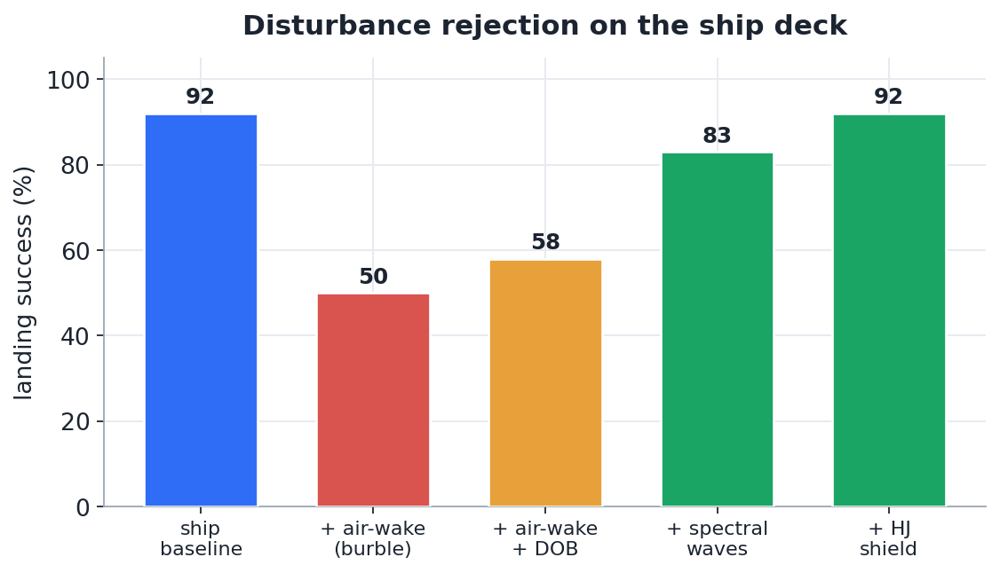
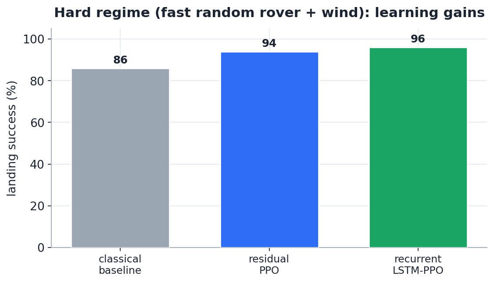

<div align="center">

# 🚁 Drone Landing on a Moving Platform

### Vision-based autonomous quadrotor recovery onto moving ground & seakeeping ship decks — flying on **onboard sensors only**, no ground truth in the loop.

[](https://www.python.org/)
[](LICENSE)
[](https://mujoco.org/)
[](tests/)
[](https://github.com/astral-sh/ruff)
[](docs/RESULTS.md)



| ground rover | rough-sea ship deck | offshore OSV | swarm (4 drones) |
|:---:|:---:|:---:|:---:|
|  |  |  |  |

*Closed-loop vision autopilot — every frame above is flown from simulated onboard sensors with **no privileged state**.*

</div>

---

## Why this project

Landing a multirotor on a **moving, oscillating platform** — a rover, a truck, or a ship deck pitching in a seaway — is one of the genuinely hard problems in field robotics: the target is non-stationary, the only state you have is what your own sensors can infer, wind and air-wake fight you, and you get one shot at touchdown. This repository is a **full, honest, research-grade attempt at the whole problem**, end to end:

- 🎯 **A complete vision-to-thrust stack** — ArUco perception → relative-state Kalman filter → landing-supervisor FSM → choice of geometric / MPC / image-based / learned control → motor mixing → true contact touchdown.
- 🌊 **Real maritime fidelity** — 6-DOF seakeeping ship decks driven by **JONSWAP / Pierson–Moskowitz wave spectra + RAOs**, plus a ship **air-wake (burble)** turbulence field, the dominant real shipboard-landing disturbance.
- 🧠 **Modern learning + classical guarantees side by side** — residual PPO (and recurrent LSTM-PPO) that *beats* a strong classical baseline on the hard regime, alongside **Hamilton–Jacobi reachability** and **control-barrier-function** safety shields with provable certificates.
- 🐝 **A decentralized multi-drone swarm** (separate module) — N drones recovering onto K moving decks with consensus estimation, a non-bypassable CBF safety filter, a permutation-invariant GNN policy, and cooperative perception.
- 🔬 **No cheating, and no hiding the failures** — the deployable stack uses only sensor-derived state, and every result (including the ones that *don't* work, like full rotor-out recovery) is reported as measured.

> **Honesty first.** Numbers below come from the reproducible benchmark in [`docs/BENCHMARK.md`](docs/BENCHMARK.md). Known limitations and negative results are documented in [`docs/RESULTS.md`](docs/RESULTS.md), not swept under the rug.

## Table of contents

- [Headline results](#headline-results)
- [Technical highlights](#technical-highlights)
- [Quickstart](#quickstart)
- [Command-line interface](#command-line-interface)
- [Architecture](#architecture)
- [The swarm module](#the-swarm-module)
- [Repository structure](#repository-structure)
- [Documentation](#documentation)
- [Citing & license](#citing--license)

## Headline results

*Vision/estimate pipeline, no ground truth in the loop, 12 episodes per cell. Full matrix: [`docs/BENCHMARK.md`](docs/BENCHMARK.md).*

<div align="center">

|  |  |
|:---:|:---:|
| **Landing success across platforms** | **Controllers (ground & ship)** |
|  |  |
| **Disturbance rejection (ship air-wake + DOB)** | **Learning beats the classical baseline (hard regime)** |

</div>

**Selected numbers:**

| capability | result |
|---|---|
| Ground rover (cruising) / ship (moderate sea) | **~90% / ~92%** landing success, vision-only |
| Hardest regime (fast random rover + wind) | classical **86%** → **residual PPO 94%** → **recurrent LSTM-PPO 96%** |
| Ship air-wake (burble) disturbance | 86% → **58%** (air-wake on) → **83%** recovered with the disturbance observer (`--dob`) |
| Tube / DOB-MPC station-keeping under wind | **~80× tighter** tracking vs plain MPC |
| Formal-safety shield (reckless dive + random wind) | 100% hard impacts (5.25 m/s) → **8%** (0.40 m/s) under the HJ-reachability shield |
| Swarm (3–8 drones, one moving deck, real MuJoCo physics) | **100% all-landed**, separation never violated |
| Swarm multi-deck, a deck fouls mid-recovery | **100% recovered** via auction re-tasking vs **0%** static assignment |
| Cooperative perception (blind drone recovers deck from neighbours) | **4.24 m → 0.34 m** estimate error |

## Technical highlights

<details open>
<summary><b>Perception & estimation</b></summary>

- **ArUco grid + nested centre marker** decoded with OpenCV `solvePnP`, fused in a **relative-state Extended Kalman Filter** (innovation-gated, IMU-aided) that tracks deck-relative position/velocity through the approach.
- A **stabilized nadir gimbal** decouples camera pointing from body attitude — fixing the tilt→vision-loss coupling that otherwise kills aggressive approaches.
- A **learned CNN deck detector** (spatial-softmax soft-argmax regression) gives an ArUco-independent markerless fix (`--cnn-markerless`).
- A **downward optical-flow + laser unit** (PMW3901-class) supplies deck-relative velocity in the <0.3 m close-range zone where the fiducial is too zoomed to decode.

</details>

<details>
<summary><b>Control</b></summary>

- **Geometric SE(3)** controller (default) with leaky integral + conditional-integration anti-windup.
- **Nonlinear MPC** (CasADi) and a **tube / DOB-MPC** variant that folds a disturbance estimate into the prediction model and tightens constraints — ~80× tighter station-keeping under steady wind.
- **Image-based visual servoing (IBVS)** using image-space position + optical-flow velocity (removes velocity-spike fly-offs).
- A **landing-supervisor finite-state machine** (`APPROACH → DESCEND → COMMIT → SECURED / GO_AROUND`) owns the commit/press/cut logic and, for ships, a **green-deck heave-synchronized descent** driven by an onboard motion predictor.

</details>

<details>
<summary><b>Learning</b></summary>

- A **Gymnasium environment** trained on a *calibrated estimator-noise surrogate* (rendering is ~100× too slow for RL), then evaluated honestly on the full vision pipeline.
- **Residual PPO** perturbing the classical baseline (action = 0 → the proven controller) so RL only has to learn refinements — beats the 86% baseline at **94%** on the hard regime.
- **Recurrent (LSTM) PPO** for the partial-observability POMDP — **96%**, edging the feedforward policy.
- Three RL bugs (reward-suicide, sign error, vz-authority hover) were each caught only by *evaluating checkpoints*, never by reward curves — a documented lesson in [`docs/RESEARCH_NOTES.md`](docs/RESEARCH_NOTES.md).

</details>

<details>
<summary><b>Formal safety</b></summary>

- **Hamilton–Jacobi reachability** computes a verified safe-landing set for the vertical channel under a disturbance bound; a runtime-assurance **shield** keeps any controller inside it (`drone reachability`, `--shield`).
- **Higher-order control barrier functions** (relative-degree-2, latency-aware) for sense-and-avoid past obstacles, solved as an acceleration QP.
- A **PX4-style contingency FSM** (geofence / low-battery RTL / lost-comms / abort / rotor-out) prioritizes failsafes.

</details>

<details>
<summary><b>Maritime fidelity</b></summary>

- **6-DOF seakeeping decks** (heave/sway/surge + roll/pitch/yaw) driven by validated motion models and **JONSWAP / Pierson–Moskowitz spectra → response-amplitude operators**.
- A position-dependent **ship air-wake / burble** turbulence field over the deck.
- **Data-driven deck replay** (`--motion-data <csv>`) — drop in recorded or NDBC-style seakeeping traces.

</details>

<details>
<summary><b>Swarm (decentralized, separate module)</b></summary>

- **No-cheats decentralized sensing** — coordination runs on per-drone noisy estimates + latency/dropout-limited neighbour broadcasts.
- **Distributed Kalman-Consensus** deck estimation; **non-bypassable CBF-QP safety filter** with a provable discrete-time separation certificate.
- A **permutation-invariant GNN policy** that generalizes across swarm size; **Hungarian + auction** dynamic re-tasking across K moving decks.
- **Cooperative perception** (V2VNet / Where2comm-style) with learned attention fusion that rejects confident outliers and value-of-information communication gating.

</details>

## Quickstart

```bash
# Python 3.10+. Installs the `drone` and `swarm` commands.
python -m pip install -e ".[vision,mpc,rl,viz]"

python -m pytest -q          # run the test suite (112 tests, all green)

drone list                   # show every scenario, controller, and preset
drone info                   # build status: worlds, deps, GPU/CPU, trained policies
drone run ship --sea rough   # headless evaluation of one scenario
drone watch ship             # live MuJoCo 3-D viewer
```

> No install? Use `python -m drone_landing ...` with `PYTHONPATH=src`.

## Command-line interface

Two polished entry points: **`drone`** (single-drone) and **`swarm`** (multi-drone). `run`/`parallel` are headless metric evaluations; `watch` opens an interactive MuJoCo window. Run `drone list` / `drone info` / `swarm info` for the live capability summary.

> **Full reference:** every subcommand, flag, and named preset is documented in **[`docs/CLI.md`](docs/CLI.md)**. The most-used commands:

```bash
drone run --scenario ground --controller mpc --episodes 20
drone run ship --sea-model spectral      # JONSWAP/PM wave spectrum + RAOs
drone run ship --airwake --dob           # ship air-wake + disturbance observer that recovers it
drone reachability                        # HJ safe-landing set + runtime-assurance shield
drone safety                              # higher-order-CBF sense-and-avoid + contingency FSM
drone run ship --cnn-markerless           # learned CNN deck detector fallback
drone parallel --all --episodes 12        # the whole preset matrix, in parallel
drone train --scenario ground --algo recurrent_ppo   # train the recurrent residual policy
```

| dimension | choices |
|---|---|
| **scenario** | `ground` (random rover) · `ship` (6-DOF wave deck) · `offshore` (OSV vessel) · `inclined` (`--incline gentle\|moderate\|steep`) · `usv` (agile craft) · `truck` (road loop) |
| **controller** | `geometric` (default) · `mpc` (CasADi) · `ibvs` (image-based) · `rl` (trained residual policy) |
| **sea** | `calm` · `moderate` · `rough`; `--sea-model spectral` (JONSWAP/PM); `--motion-data <csv>` (recorded replay) |
| **disturbance** | correlated wind gusts on by default (`--no-wind` to ablate); `--airwake`; `--dob` |
| **safety** | `drone reachability` / `--shield` (HJ) · `drone safety` / `--avoid` (CBF sense-and-avoid + contingency) |
| **perception** | `--markerless` (classical pad fallback) · `--cnn-markerless` (learned detector) |
| **robustness** | `--fail-rotor K` rotor-out stress-test (`--fail-rotor-mode floquet` for the averaged-precession controller) |

### Swarm

```bash
swarm run --drones 4 --scenario ship --sea moderate    # real MuJoCo physics
swarm run --drones 6 --consensus                       # distributed Kalman-Consensus deck estimation
swarm verify --drones 6 --seeds 25                     # sweep seeds, assert no separation violation
swarm multi --drones 9 --decks 3 --foul-deck 2         # K moving decks + dynamic re-tasking
swarm run --vision --cameras 2                         # cooperative perception (camera-less drones recover from neighbours)
swarm active                                           # learned attention fusion + value-of-information gating
swarm watch --drones 4 --scenario ship                 # live MuJoCo viewer
```

Full design notes: [`docs/SWARM.md`](docs/SWARM.md).

## Architecture

The deployable stack flies on **onboard sensors only** — no privileged simulator state ever enters a control or coordination decision (the [no-cheats realism charter](docs/REALISM_CHARTER.md)).

```
camera (ArUco grid + nested centre marker)  ─┐
IMU / AHRS, rangefinder, gear-contact        ─┼─►  RelativeStateEKF  ─►  LandingSupervisor (FSM)  ─►  control  ─►  4 motor thrusts
stabilized nadir gimbal + optical-flow vel   ─┘      (relative state)      APPROACH→DESCEND→COMMIT        │
                                                                            →SECURED / GO_AROUND          ├─ geometric SE(3)  (default)
                                                                                                          ├─ nonlinear / tube MPC (CasADi)
                                                                                                          ├─ IBVS (image-based)
                                                                                                          └─ residual RL (PPO / LSTM)
```

A detailed component walkthrough — physics, perception, estimation, control, learning, safety, and swarm — is in **[`docs/ARCHITECTURE.md`](docs/ARCHITECTURE.md)**.

## The swarm module

`src/drone_landing_swarm/` is a **completely separate package** with its own `swarm` CLI — it reuses the single-drone components without modifying them, so the validated single-drone behavior is never touched.

| feature | what it adds |
|---|---|
| **A1** onboard sensing | no-cheats decentralized view (noisy estimates + comms range/latency/dropout) |
| **A2** consensus | distributed Kalman-Consensus deck estimation; blind drones recover from neighbours |
| **A3** safety | non-bypassable CBF-QP filter + provable forward-invariance certificate; 0 separation violations |
| **A4** GNN policy | permutation-invariant graph policy; one policy generalizes across swarm size |
| **A5** multi-deck | M drones → K moving decks, Hungarian + auction re-tasking; recovers a fouled deck (100% vs 0%) |
| **CP** cooperative perception | per-drone onboard vision; blind drones recover the deck from neighbours' fixes (4.24 → 0.34 m) |
| **A6** active perception | learned attention fusion (rejects confident outliers) + value-of-information comms gating |

## Repository structure

```
src/
  drone_landing/            # single-drone stack
    perception/             # ArUco, CNN detector, camera, optical flow, markerless
    estimation/             # relative-state EKF
    planning/               # landing supervisor FSM + green-deck heave predictor
    control/                # geometric, MPC (+ tube/DOB), IBVS, reachability, allocation, rotor-out
    sim/                    # MuJoCo world, sensor models, platform motion models, air-wake
    rl/                     # Gymnasium env, residual policy, PPO/LSTM training
    safety/                 # obstacles, higher-order-CBF avoidance, contingency FSM
    cli.py                  # the `drone` command
  drone_landing_swarm/      # separate multi-drone package + the `swarm` command
assets/mujoco/              # validated worlds (ground / ship / offshore), Skydio X2 mesh, ArUco textures
assets/seakeeping/          # recorded-style 6-DOF deck-motion CSVs
scripts/                    # benchmark + demo-media generators + evaluation utilities
tests/                      # pytest suite (112 tests)
docs/                       # results, architecture, swarm, safety, research notes, full progress log
```

## Documentation

| document | contents |
|---|---|
| [`docs/RESULTS.md`](docs/RESULTS.md) | consolidated, honest results and findings (incl. negative results) |
| [`docs/ARCHITECTURE.md`](docs/ARCHITECTURE.md) | full component walkthrough of the stack |
| [`docs/CLI.md`](docs/CLI.md) | complete command-line reference (every subcommand, flag, and preset) |
| [`docs/BENCHMARK.md`](docs/BENCHMARK.md) | reproducible controller × scenario × disturbance matrix |
| [`docs/SWARM.md`](docs/SWARM.md) | swarm coordination, consensus, safety, GNN, cooperative perception |
| [`docs/SAFETY.md`](docs/SAFETY.md) | reachability shield, CBF avoidance, contingency FSM |
| [`docs/RESEARCH_NOTES.md`](docs/RESEARCH_NOTES.md) | method choices, literature, and debugging lessons |
| [`docs/REALISM_CHARTER.md`](docs/REALISM_CHARTER.md) | the no-cheats simulation-fidelity rules |
| [`docs/PROGRESS_LOG.md`](docs/PROGRESS_LOG.md) | detailed checkpointed build history |

## Citing & license

Released under the [MIT License](LICENSE). If you use this work, please cite it (see [`CITATION.cff`](CITATION.cff)):

```bibtex
@software{reddy_drone_landing_2026,
  author  = {Reddy, Manas},
  title   = {Drone Landing on a Moving Platform: a vision-based autonomous quadrotor recovery stack},
  year    = {2026},
  url     = {https://github.com/Manas-arumalla/drone-landing-moving-platform}
}
```

**Acknowledgements:** built on [MuJoCo](https://mujoco.org/); the Skydio X2 model derives from Google DeepMind's [MuJoCo Menagerie](https://github.com/google-deepmind/mujoco_menagerie) (Apache-2.0). Method choices draw on the visual-servoing, shipboard-recovery, reachability/CBF, and cooperative-perception literature catalogued in [`docs/RESEARCH_NOTES.md`](docs/RESEARCH_NOTES.md).
